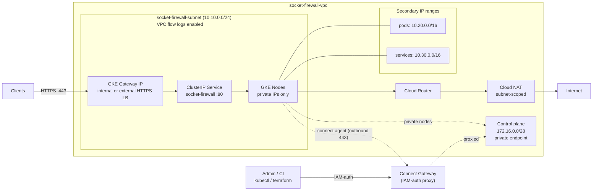
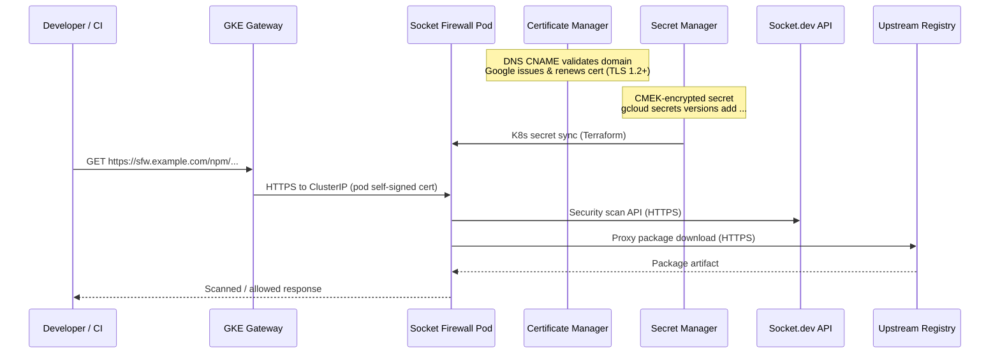

# Security Socket Firewall

Terraform configuration for deploying [Socket Firewall](https://socket.dev) on a hardened private GKE cluster in Google Cloud. The stack provisions networking, IAM, CMEK encryption, secrets, and a Helm release that proxies and scans package traffic to upstream registries (npm, PyPI, Maven).

Infrastructure code lives in [`terraform/`](terraform/).

## Architecture overview

The deployment runs Socket Firewall on a **private GKE cluster** with a **GKE Gateway**, **Google-managed TLS** via Certificate Manager, **Cloud NAT** for outbound traffic, **CMEK encryption**, **Binary Authorization**, **Calico NetworkPolicies**, and **Secret Manager** for the Socket.dev API token.

The control plane has **no public endpoint and no inbound path** (private endpoint, `172.16.0.0/28`). Terraform and `kubectl` reach it through **fleet Connect Gateway** — the cluster's GKE-managed Connect agent opens an *outbound* channel to Google, and `connectgateway.googleapis.com` proxies IAM-authenticated traffic back down it. This works identically from a local machine and from a **GitHub-hosted CI runner** with no bastion, IAP tunnel, or VPC peering. CI runs via Workload Identity Federation with two service accounts: a read-only **plan** SA (PR) and a write **apply** SA (push to `main`).

```mermaid
flowchart TB
    subgraph TF["Terraform (state: GCS)"]
        TF_APPLY["Apply SA (WIF)<br/>tf-apply@... (write)"]
        TF_PLAN["Plan SA (WIF)<br/>tf-plan@... (read-only)"]
        GCS["GCS Backend<br/>sac-prod-tf--socket-firewall"]
    end

    subgraph GCP["GCP Project"]
        subgraph KMS["Cloud KMS"]
            KEYRING["Key ring<br/>etcd / node disk / secret"]
        end

        subgraph CM["Certificate Manager"]
            DNS_AUTH["DNS Authorization"]
            CERT["Managed Certificate"]
            CERT_MAP["Certificate Map"]
            SSL["SSL Policy<br/>MODERN, TLS 1.2+"]
        end

        subgraph SM["Secret Manager (CMEK)"]
            API_SECRET["socket-firewall-api-token"]
        end

        subgraph VPC["VPC: socket-firewall-vpc"]
            subgraph SUBNET["Subnet + VPC flow logs<br/>10.10.0.0/24"]
                subgraph GKE["GKE Private Cluster: socket-firewall"]
                    subgraph NS["Namespace: socket-firewall"]
                        GW["GKE Gateway<br/>rilb (internal) / global-external"]
                        GW_POLICY["GCPGatewayPolicy"]
                        ROUTE["HTTPRoute"]
                        NETPOL["NetworkPolicies<br/>deny ingress by default"]
                        HELM["Helm: socket-firewall"]
                        PODS["Firewall Pods<br/>replicas: 2, HTTPS :8443<br/>(self-signed internal cert)"]
                        PDB["PodDisruptionBudget"]
                        K8S_SECRET["K8s Secret<br/>socket-api-token"]
                        SVC["Service: ClusterIP"]
                    end
                    NODES["Node Pool<br/>CMEK disks, shielded<br/>Binary Auth enforced"]
                    CONNECT["Connect agent<br/>(fleet membership)"]
                end
                NAT["Cloud Router + Cloud NAT<br/>subnet-scoped"]
                FW_DENY["Firewall: deny all egress<br/>priority 65534"]
                FW_ALLOW["Firewall: allow egress<br/>TCP 443 only"]
            end
            CP["Private Control Plane<br/>172.16.0.0/28 (no public endpoint)<br/>auth: internal subnet only<br/>etcd encrypted (CMEK)"]
        end

        NODE_SA["GKE Node SA<br/>logging + monitoring roles"]
        CGW["Connect Gateway<br/>connectgateway.googleapis.com<br/>(IAM-auth proxy)"]
    end

    subgraph EXTERNAL["External"]
        CLIENTS["Clients<br/>CI/CD, dev machines"]
        DNS["DNS provider"]
        REGISTRIES["Upstream registries<br/>npm / pypi / maven"]
        SOCKET_API["Socket.dev API"]
        ADMIN["Admin / CI<br/>kubectl / terraform"]
    end

    TF_APPLY --> GCS
    TF_PLAN --> GCS
    TF_APPLY --> GCP
    KMS --> SM
    KMS --> GKE
    KMS --> NODES
    TF_APPLY --> API_SECRET
    TF_APPLY --> CM
    DNS_AUTH --> DNS
    CERT --> CERT_MAP
    CERT_MAP --> GW
    SSL --> GW_POLICY --> GW
    API_SECRET --> K8S_SECRET
    K8S_SECRET --> HELM
    HELM --> PODS
    NETPOL --> PODS
    PDB --> PODS
    PODS --> SVC
    GW --> ROUTE --> SVC
    NODES --> PODS
    NODE_SA --> NODES

    CLIENTS -->|"HTTPS (TLS at gateway)"| GW
    PODS -->|"scan packages"| SOCKET_API
    PODS -->|"proxy /npm, /pypi, /maven"| REGISTRIES
    NODES --> FW_DENY
    NODES --> FW_ALLOW --> NAT --> REGISTRIES
    NODES --> NAT --> SOCKET_API
    ADMIN -->|"IAM-auth kubectl/terraform"| CGW
    CONNECT -.->|"outbound channel"| CGW
    CGW -.->|"proxied to private endpoint"| CP
```



## Network topology



Egress from GKE nodes is **deny-by-default** at the VPC firewall layer. Only **TCP 443** is permitted outbound (HTTPS to Socket.dev and upstream registries, and the fleet Connect agent's outbound channel to Google). Port 80 is intentionally blocked.

## Data flow



## Components

| Layer | Resource | Purpose |
|-------|----------|---------|
| **State** | GCS `sac-prod-tf--socket-firewall` | Remote Terraform state |
| **Network** | VPC + subnet + secondary ranges | Isolated network; subnet has VPC flow logs |
| **Egress** | Deny-all + allow TCP 443 + Cloud NAT | Default-deny egress; HTTPS-only outbound via NAT scoped to the subnet |
| **Compute** | Private GKE cluster + node pool | Shielded nodes, deletion protection, Calico NetworkPolicy, Binary Authorization |
| **Encryption** | Cloud KMS key ring (3 keys) | CMEK for etcd secrets, node boot disks, and Secret Manager |
| **Access** | Fleet membership + Connect Gateway | IAM-authenticated proxy to the private control plane; no public endpoint, bastion, or IAP tunnel |
| **App** | Helm `socket-firewall` | Package firewall with path-based routing, pod anti-affinity, PDB |
| **Exposure** | GKE Gateway or `LoadBalancer` Service | Internal (`gke-l7-rilb`) or external (`gke-l7-global-external-managed`) via `internal_load_balancer` |
| **Secrets** | Secret Manager (CMEK) → K8s secret | `SOCKET_SECURITY_API_TOKEN` for Socket.dev |
| **TLS** | Certificate Manager + GKE Gateway + SSL policy | Google-managed cert; HTTPS terminates at the LB (TLS 1.2 minimum) |
| **Policy** | Kubernetes NetworkPolicies | Default-deny ingress in the firewall namespace (`enable_network_policies = true`) |
| **IAM** | GKE node SA + custom Terraform roles | Least-privilege; separate read-only plan SA and write apply SA, both via WIF |

## Security

| Control | Implementation |
|---------|----------------|
| **Encryption at rest** | CMEK for GKE etcd, node disks, and Secret Manager (90-day key rotation) |
| **Encryption in transit** | GCP-managed TLS at the Gateway; SSL policy enforces MODERN cipher suites and TLS 1.2+ |
| **Network egress** | VPC firewall deny-all with explicit TCP 443 allow; Kubernetes egress governed by VPC rules |
| **Network ingress** | Calico NetworkPolicies default-deny ingress in the firewall namespace |
| **Image admission** | Binary Authorization (`PROJECT_SINGLETON_POLICY_ENFORCE`) |
| **Node hardening** | Shielded VMs, dedicated node SA (no `cloud-platform` scope), Workload Identity, legacy metadata endpoints disabled |
| **Control plane** | Private endpoint only — no public API server; reachable solely via Connect Gateway (IAM-authenticated) |
| **Availability** | Pod anti-affinity across nodes, PodDisruptionBudget (`minAvailable: 1`), 2-node minimum |
| **IAM least privilege** | Custom Terraform roles replace `container.admin`/`secretmanager.secretAdmin`/`cloudkms.admin` (no project-wide secret payload access); read-only plan SA distinct from write apply SA; fleet write access is bootstrap-only |
| **Audit** | VPC flow logs and firewall rule logging with full metadata |

## Path routing

When `firewall_domain` is set, the firewall exposes these upstream routes (defaults):

| Path | Upstream | Registry |
|------|----------|----------|
| `/npm` | `registry.npmjs.org` | npm |
| `/pypi` | `pypi.org` | pypi |
| `/maven` | `repo1.maven.org/maven2` | maven |

Health check endpoint: `https://<firewall_domain>/health`

## TLS

When `firewall_domain` is set and `enable_gcp_managed_tls = true` (default), Terraform provisions:

1. A **Certificate Manager DNS authorization** — publish the CNAME from `terraform output tls_dns_authorization_record`
2. A **Google-managed certificate** — becomes `ACTIVE` after DNS validation (typically 15–60 minutes)
3. A **GKE Gateway** with a **certificate map** — terminates the public HTTPS at the load balancer (internal `gke-l7-rilb` or external `gke-l7-global-external-managed`, selected by `internal_load_balancer`)
4. An **SSL policy** (`MODERN`, TLS 1.2 minimum) attached via **GCPGatewayPolicy** — regional for internal gateways, global for external
5. An **HTTPRoute** — forwards traffic to the firewall pods

The Gateway terminates the public, browser-trusted certificate. The Socket Firewall container always serves HTTPS on its internal port (`:8443`, the target of its own health probe), so the pod keeps a **self-signed certificate** for the internal Gateway→pod hop even when GCP-managed TLS is enabled. That hop is over the cluster-internal `ClusterIP` and is never externally reachable.

To use a pre-existing Kubernetes TLS secret instead (pod-level TLS with a `LoadBalancer` Service), set `enable_gcp_managed_tls = false` and `tls_existing_secret = "<secret-name>"`.

## Terraform layout

| File | Description |
|------|-------------|
| [`main.tf`](terraform/main.tf) | Providers (google, google-beta, kubernetes, helm, kubectl), GCS backend, Connect Gateway provider configuration |
| [`apis.tf`](terraform/apis.tf) | Required GCP API enablement (incl. `gkehub`, `connectgateway`) |
| [`kms.tf`](terraform/kms.tf) | CMEK key ring and keys for etcd, node disks, and Secret Manager |
| [`network.tf`](terraform/network.tf) | VPC, subnet (flow logs), Cloud NAT, egress firewall rules |
| [`network_policy.tf`](terraform/network_policy.tf) | Kubernetes NetworkPolicies (default-deny ingress) |
| [`gke.tf`](terraform/gke.tf) | Private GKE cluster (CMEK etcd, Calico, Binary Auth, Gateway API) and node pool |
| [`fleet.tf`](terraform/fleet.tf) | Fleet (GKE Hub) membership enabling Connect Gateway access to the private control plane |
| [`iam.tf`](terraform/iam.tf) | GKE node SA, custom least-privilege Terraform roles (apply + plan SA), IAM bindings |
| [`secrets.tf`](terraform/secrets.tf) | CMEK-encrypted Secret Manager secret for the Socket API token |
| [`helm.tf`](terraform/helm.tf) | Namespace, K8s secret, Helm release, PodDisruptionBudget |
| [`tls.tf`](terraform/tls.tf) | Certificate Manager, SSL policy, GKE Gateway, GCPGatewayPolicy, HTTPRoute |
| [`variables.tf`](terraform/variables.tf) | Input variables |
| [`outputs.tf`](terraform/outputs.tf) | Cluster credentials, gateway IP, DNS auth record, health URL |

## Getting started

### Prerequisites

- A GCP project with billing enabled
- Two Terraform service accounts — a write **apply** SA (`terraformer`) and a read-only **plan** SA (`terraformer_plan`) — bootstrapped as described below
- Workload Identity Federation configured for the GitHub repo if you use the CI workflows (`WIF_PROVIDER`, `WIF_APPLY_SERVICE_ACCOUNT`, `WIF_PLAN_SERVICE_ACCOUNT`)

No VPC peering, bastion, or IAP tunnel is required. The private control plane is reached over **fleet Connect Gateway**, so `terraform apply` and `kubectl` work from a local machine or a GitHub-hosted runner once the SA is authenticated (`gcloud auth application-default login` locally, or WIF in CI).

### Bootstrap IAM

The steady-state, least-privilege roles for both service accounts are defined and bound **by Terraform itself** in [`terraform/iam.tf`](terraform/iam.tf) — custom roles replace the broad predefined `container.admin`, `secretmanager.secretAdmin`, and `cloudkms.admin` roles.

Roles Terraform grants to the **apply SA**:

| Role | Purpose |
|------|---------|
| Custom `socketFirewallTfGkeManager` | GKE cluster / node-pool lifecycle (GCP control plane only) |
| `roles/container.developer` | Kubernetes API access for the helm/kubernetes/kubectl providers |
| `roles/compute.networkAdmin` | VPC, subnet, NAT, firewall rules |
| Custom `socketFirewallTfServiceAccountManager` | Manage the GKE node service account |
| Custom `socketFirewallTfSecretManager` | Manage Secret Manager resources (no project-wide payload read) |
| `roles/secretmanager.secretAccessor` | Read the Socket API token (resource-scoped) |
| Custom `socketFirewallTfKmsManager` | CMEK key ring / key management (no key or version destruction) |
| `roles/certificatemanager.editor` | Certificate Manager certs and DNS authorizations |
| `roles/iam.serviceAccountUser` | Attach the node SA to node-pool VMs |
| `roles/gkehub.gatewayEditor` + `roles/gkehub.viewer` | Reach the control plane via Connect Gateway; refresh the fleet membership |

The **plan SA** receives read-only equivalents: custom `socketFirewallTfPlanReader`, `roles/container.viewer`, `roles/certificatemanager.viewer`, and `roles/gkehub.gatewayReader`.

Because Terraform creates these custom roles and bindings on the first apply, the bootstrap identity (a project admin) must first grant the apply SA enough elevated access to perform that initial run, then tighten it:

| Bootstrap grant | Why | After first apply |
|------|-----|-------------------|
| `roles/iam.roleAdmin` | Create the custom roles in `iam.tf` | Keep (roles are re-managed on every apply) |
| `roles/resourcemanager.projectIamAdmin` | Create the project IAM bindings in `iam.tf` | Keep |
| `roles/serviceusage.serviceUsageAdmin` | Enable the required APIs (`apis.tf`) | Keep |
| `roles/gkehub.editor` | Register the fleet membership (`fleet.tf`, `memberships.create`) | **Revoke** — steady-state only refreshes it via `gkehub.viewer` |

Also grant the **plan SA** read access to the Terraform state bucket (it cannot be managed in code, since it is the backend):

```bash
gsutil iam ch serviceAccount:<PLAN_SA_EMAIL>:objectViewer gs://sac-prod-tf--socket-firewall
```

### CI/CD

Two GitHub Actions workflows authenticate via Workload Identity Federation (no long-lived keys):

| Workflow | Trigger | Identity | Action |
|----------|---------|----------|--------|
| [`tf-plan.yaml`](.github/workflows/tf-plan.yaml) | Pull request to `main` | Plan SA (read-only) | `terraform plan`, posts diff as a PR comment |
| [`tf-apply.yaml`](.github/workflows/tf-apply.yaml) | Push to `main` | Apply SA (write) | `terraform apply -auto-approve` (in the `production` environment) |

Both runners are GitHub-hosted and reach the private control plane through Connect Gateway — no self-hosted runner inside the VPC is needed.

### Deploy

1. Initialise Terraform and create the KMS key ring and Secret Manager secret container:

   ```bash
   cd terraform
   terraform init
   terraform apply \
     -target=google_kms_key_ring.main \
     -target=google_kms_crypto_key.secret \
     -target=google_kms_crypto_key_iam_member.secret \
     -target=google_secret_manager_secret.socket_api_token
   ```

2. Load the Socket API token into the secret created in step 1:

   ```bash
   gcloud secrets versions add socket-firewall-api-token --data-file=- <<< "sktsec_..."
   ```

3. Apply the rest of the stack (Connect Gateway handles control-plane access, so this works locally or in CI):

   ```bash
   terraform apply
   ```

4. If `firewall_domain` is set and `enable_gcp_managed_tls = true` (default), configure DNS:

   ```bash
   # Publish the CNAME for certificate validation
   terraform output tls_dns_authorization_record

   # After the certificate is ACTIVE (15–60 min), point the domain at the gateway IP
   terraform output firewall_load_balancer_ip
   ```

5. Configure `kubectl`. The control plane has no public endpoint, so fetch credentials through Connect Gateway rather than the direct endpoint:

   ```bash
   gcloud container fleet memberships get-credentials socket-firewall --project <project_id>
   ```

> **Note:** `terraform.tfvars` is gitignored and must not be committed — it may contain environment-specific values.

> **CMEK migration warning:** If an existing Secret Manager secret used auto-replication, switching to CMEK user-managed replication forces secret replacement and deletes existing versions. Re-add the token value after apply.
