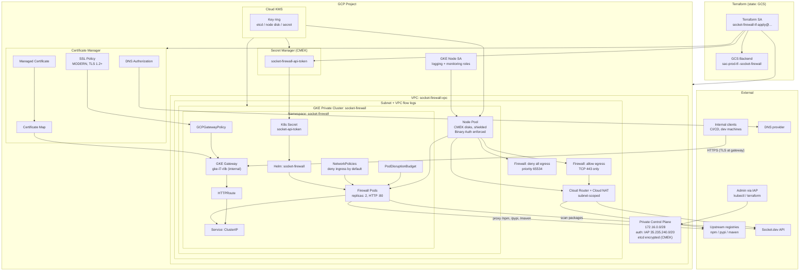
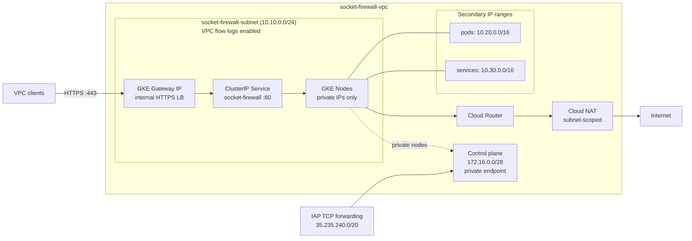
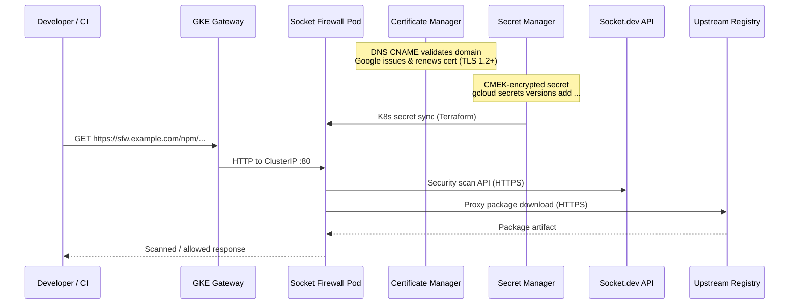

# Security Socket Firewall

Terraform configuration for deploying [Socket Firewall](https://socket.dev) on a hardened private GKE cluster in Google Cloud. The stack provisions networking, IAM, CMEK encryption, secrets, and a Helm release that proxies and scans package traffic to upstream registries (npm, PyPI, Maven).

Infrastructure code lives in [`terraform/`](terraform/).

## Architecture overview

The deployment runs Socket Firewall on a **private GKE cluster** with a **GKE Gateway** (internal by default), **Google-managed TLS** via Certificate Manager, **Cloud NAT** for outbound traffic, **CMEK encryption**, **Binary Authorization**, **Calico NetworkPolicies**, and **Secret Manager** for the Socket.dev API token.



## Network topology



Egress from GKE nodes is **deny-by-default** at the VPC firewall layer. Only **TCP 443** is permitted outbound (HTTPS to Socket.dev and upstream registries). Port 80 is intentionally blocked.

## Data flow



## Components

| Layer | Resource | Purpose |
|-------|----------|---------|
| **State** | GCS `sac-prod-tf--socket-firewall` | Remote Terraform state |
| **Network** | VPC + subnet + secondary ranges | Isolated network; subnet has VPC flow logs |
| **Egress** | Deny-all + allow TCP 443 + Cloud NAT | Default-deny egress; HTTPS-only outbound via NAT scoped to the subnet |
| **Compute** | Private GKE cluster + node pool | Shielded nodes, deletion protection, Calico NetworkPolicy, Binary Authorization |
| **Encryption** | Cloud KMS key ring (3 keys) | CMEK for etcd secrets, node boot disks, and Secret Manager |
| **Access** | IAP-authorized control plane | Private API endpoint; only path to the cluster API server |
| **App** | Helm `socket-firewall` | Package firewall with path-based routing, pod anti-affinity, PDB |
| **Exposure** | GKE Gateway or `LoadBalancer` Service | Internal gateway by default (`internal_load_balancer = true`) |
| **Secrets** | Secret Manager (CMEK) → K8s secret | `SOCKET_SECURITY_API_TOKEN` for Socket.dev |
| **TLS** | Certificate Manager + GKE Gateway + SSL policy | Google-managed cert; HTTPS terminates at the LB (TLS 1.2 minimum) |
| **Policy** | Kubernetes NetworkPolicies | Default-deny ingress in the firewall namespace (`enable_network_policies = true`) |
| **IAM** | GKE node SA + custom Terraform SA roles | Least-privilege; custom roles for SA and Secret Manager management |

## Security

| Control | Implementation |
|---------|----------------|
| **Encryption at rest** | CMEK for GKE etcd, node disks, and Secret Manager (90-day key rotation) |
| **Encryption in transit** | GCP-managed TLS at the Gateway; SSL policy enforces MODERN cipher suites and TLS 1.2+ |
| **Network egress** | VPC firewall deny-all with explicit TCP 443 allow; Kubernetes egress governed by VPC rules |
| **Network ingress** | Calico NetworkPolicies default-deny ingress in the firewall namespace |
| **Image admission** | Binary Authorization (`PROJECT_SINGLETON_POLICY_ENFORCE`) |
| **Node hardening** | Shielded VMs, dedicated node SA (no `cloud-platform` scope), legacy metadata endpoints disabled |
| **Availability** | Pod anti-affinity across nodes, PodDisruptionBudget (`minAvailable: 1`), 2-node minimum |
| **IAM least privilege** | Custom Terraform roles for service account and Secret Manager management (no project-wide secret payload access) |
| **Audit** | VPC flow logs and firewall rule logging with full metadata |

## Path routing

When `firewall_domain` is set, the firewall exposes these upstream routes (defaults):

| Path | Upstream | Registry |
|------|----------|----------|
| `/npm` | `registry.npmjs.org` | npm |
| `/pypi` | `pypi.org` | pypi |
| `/maven` | `repo1.maven.org/maven2` | maven |

Health check endpoint: `https://<firewall_domain>/health`

## TLS

When `firewall_domain` is set and `enable_gcp_managed_tls = true` (default), Terraform provisions:

1. A **Certificate Manager DNS authorization** — publish the CNAME from `terraform output tls_dns_authorization_record`
2. A **Google-managed certificate** — becomes `ACTIVE` after DNS validation (typically 15–60 minutes)
3. A **GKE Gateway** with a **certificate map** — terminates HTTPS at the internal load balancer
4. An **SSL policy** (`MODERN`, TLS 1.2 minimum) attached via **GCPGatewayPolicy**
5. An **HTTPRoute** — forwards decrypted traffic to the firewall pods on port 80

Pods do not generate self-signed certificates when GCP-managed TLS is active — TLS is fully terminated at the Gateway.

To use a pre-existing Kubernetes TLS secret instead (pod-level TLS with a `LoadBalancer` Service), set `enable_gcp_managed_tls = false` and `tls_existing_secret = "<secret-name>"`.

## Terraform layout

| File | Description |
|------|-------------|
| [`main.tf`](terraform/main.tf) | Providers (google, google-beta), GCS backend, Kubernetes/Helm configuration |
| [`apis.tf`](terraform/apis.tf) | Required GCP API enablement |
| [`kms.tf`](terraform/kms.tf) | CMEK key ring and keys for etcd, node disks, and Secret Manager |
| [`network.tf`](terraform/network.tf) | VPC, subnet (flow logs), Cloud NAT, egress firewall rules |
| [`network_policy.tf`](terraform/network_policy.tf) | Kubernetes NetworkPolicies (default-deny ingress) |
| [`gke.tf`](terraform/gke.tf) | Private GKE cluster (CMEK etcd, Calico, Binary Auth, Gateway API) and node pool |
| [`iam.tf`](terraform/iam.tf) | GKE node SA, custom Terraform SA roles, IAM bindings |
| [`secrets.tf`](terraform/secrets.tf) | CMEK-encrypted Secret Manager secret for the Socket API token |
| [`helm.tf`](terraform/helm.tf) | Namespace, K8s secret, Helm release, PodDisruptionBudget |
| [`tls.tf`](terraform/tls.tf) | Certificate Manager, SSL policy, GKE Gateway, GCPGatewayPolicy, HTTPRoute |
| [`variables.tf`](terraform/variables.tf) | Input variables |
| [`outputs.tf`](terraform/outputs.tf) | Cluster credentials, gateway IP, DNS auth record, health URL |

## Getting started

### Prerequisites

- A GCP project with billing enabled
- A Terraform service account with bootstrap permissions (see [`terraform/iam.tf`](terraform/iam.tf))
- Network access to the **private GKE control plane** for applies that create Kubernetes resources — `terraform apply` must run from inside the VPC or through an IAP tunnel to the API server; it will hang or fail from a runner with no path to the private endpoint

### Bootstrap IAM

The Terraform service account needs predefined roles plus permission to create custom roles. The bootstrap identity must hold `roles/iam.roleAdmin` so the custom roles in [`terraform/iam.tf`](terraform/iam.tf) can be created on first apply. Required roles for the Terraform SA:

| Role | Purpose |
|------|---------|
| `roles/container.admin` | GKE cluster and node pools |
| `roles/compute.networkAdmin` | VPC, NAT, firewall rules |
| Custom `socketFirewallTfServiceAccountManager` | Manage the GKE node service account |
| Custom `socketFirewallTfSecretManager` | Manage Secret Manager resources (no project-wide payload read) |
| `roles/secretmanager.secretAccessor` | Read the Socket API token (resource-scoped) |
| `roles/cloudkms.admin` | Manage CMEK key ring and keys |
| `roles/certificatemanager.editor` | Certificate Manager certs and DNS authorizations |

### Deploy

1. Initialise Terraform and create the KMS key ring and Secret Manager secret container:

   ```bash
   cd terraform
   terraform init
   terraform apply \
     -target=google_kms_key_ring.main \
     -target=google_kms_crypto_key.secret \
     -target=google_kms_crypto_key_iam_member.secret \
     -target=google_secret_manager_secret.socket_api_token
   ```

2. Load the Socket API token into the secret created in step 2:

   ```bash
   gcloud secrets versions add socket-firewall-api-token --data-file=- <<< "sktsec_..."
   ```

3. Apply the rest of the stack (from a host with access to the private control plane):

   ```bash
   terraform apply
   ```

4. If `firewall_domain` is set and `enable_gcp_managed_tls = true` (default), configure DNS:

   ```bash
   # Publish the CNAME for certificate validation
   terraform output tls_dns_authorization_record

   # After the certificate is ACTIVE (15–60 min), point the domain at the gateway IP
   terraform output firewall_load_balancer_ip
   ```

5. Configure `kubectl` using the output command:

   ```bash
   gcloud container clusters get-credentials socket-firewall --zone us-central1-a --project <project_id>
   ```

> **Note:** `terraform.tfvars` is gitignored and must not be committed — it may contain environment-specific values.

> **CMEK migration warning:** If an existing Secret Manager secret used auto-replication, switching to CMEK user-managed replication forces secret replacement and deletes existing versions. Re-add the token value after apply.
