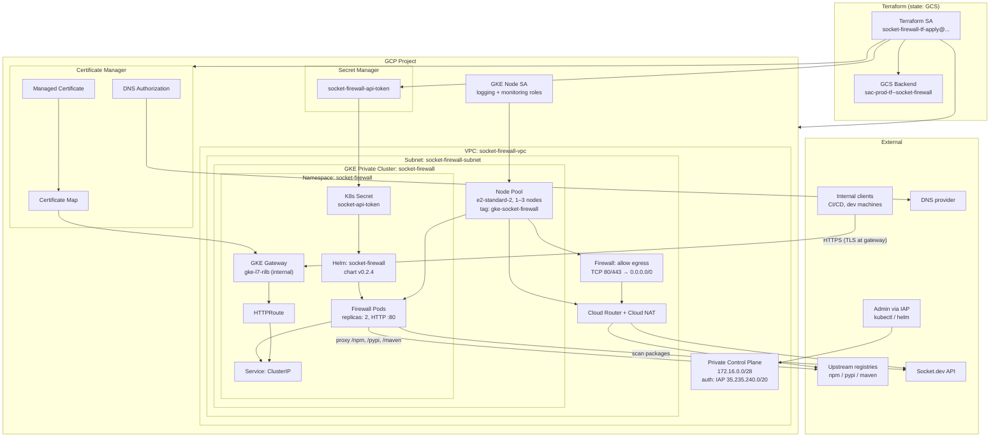
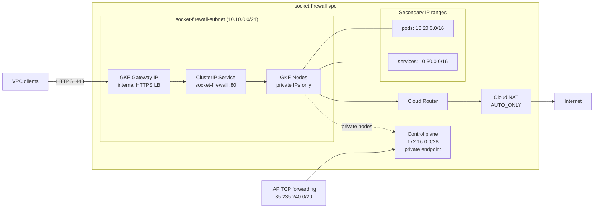
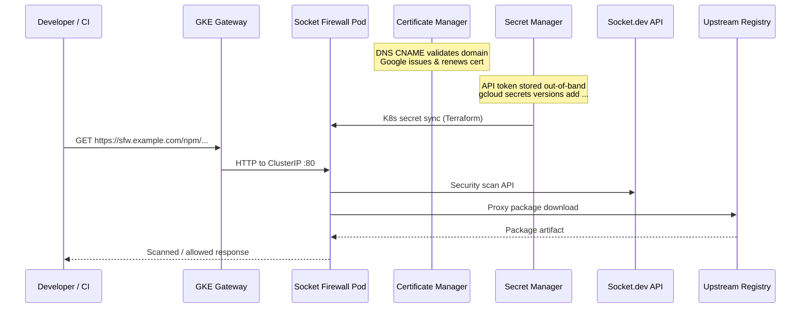

# Security Socket Firewall

Terraform configuration for deploying [Socket Firewall](https://socket.dev) on a private GKE cluster in Google Cloud. The stack provisions networking, IAM, secrets, and a Helm release that proxies and scans package traffic to upstream registries (npm, PyPI, Maven).

Infrastructure code lives in [`terraform/`](terraform/).

## Architecture overview

The deployment runs Socket Firewall on a **private GKE cluster** with a **GKE Gateway** (internal by default), **Google-managed TLS** via Certificate Manager, **Cloud NAT** for outbound traffic, and **Secret Manager** for the Socket.dev API token.



## Network topology



## Data flow



## Components

| Layer | Resource | Purpose |
|-------|----------|---------|
| **State** | GCS `sac-prod-tf--socket-firewall` | Remote Terraform state |
| **Network** | VPC + subnet + secondary ranges | Isolated network for GKE pods and services |
| **Egress** | Cloud NAT + egress firewall | Private nodes reach Socket.dev and registries (TCP 80/443) |
| **Compute** | Private GKE cluster + node pool | Runs Socket Firewall workloads |
| **Access** | IAP-authorized control plane | Only path to the private API server |
| **App** | Helm `socket-firewall` v0.2.4 | Package firewall with path-based routing |
| **Exposure** | GKE Gateway (GCP-managed TLS) or `LoadBalancer` Service | Internal gateway by default (`internal_load_balancer = true`) |
| **Secrets** | Secret Manager → K8s secret | `SOCKET_SECURITY_API_TOKEN` for Socket.dev |
| **TLS** | Certificate Manager + GKE Gateway | Google-managed cert for `firewall_domain`; HTTPS terminates at the load balancer |
| **IAM** | GKE node SA + Terraform SA | Least-privilege node ops; Terraform manages infrastructure |

## Path routing

When `firewall_domain` is set, the firewall exposes these upstream routes (defaults):

| Path | Upstream | Registry |
|------|----------|----------|
| `/npm` | `registry.npmjs.org` | npm |
| `/pypi` | `pypi.org` | pypi |
| `/maven` | `repo1.maven.org/maven2` | maven |

Health check endpoint: `https://<firewall_domain>/health`

## TLS

When `firewall_domain` is set and `enable_gcp_managed_tls = true` (default), Terraform provisions:

1. A **Certificate Manager DNS authorization** — publish the CNAME from `terraform output tls_dns_authorization_record`
2. A **Google-managed certificate** — becomes `ACTIVE` after DNS validation (typically 15–60 minutes)
3. A **GKE Gateway** with a **certificate map** — terminates HTTPS at the internal load balancer
4. An **HTTPRoute** — forwards decrypted traffic to the firewall pods on port 80

To use a pre-existing Kubernetes TLS secret instead (pod-level TLS with a `LoadBalancer` Service), set `enable_gcp_managed_tls = false` and `tls_existing_secret = "<secret-name>"`.

## Terraform layout

| File | Description |
|------|-------------|
| [`main.tf`](terraform/main.tf) | Providers, GCS backend, Kubernetes/Helm configuration |
| [`apis.tf`](terraform/apis.tf) | Required GCP API enablement |
| [`network.tf`](terraform/network.tf) | VPC, subnet, Cloud NAT, egress firewall |
| [`gke.tf`](terraform/gke.tf) | Private GKE cluster and node pool |
| [`iam.tf`](terraform/iam.tf) | GKE node SA and Terraform deployment SA roles |
| [`secrets.tf`](terraform/secrets.tf) | Secret Manager secret for the Socket API token |
| [`helm.tf`](terraform/helm.tf) | Namespace, K8s secret, Helm release |
| [`tls.tf`](terraform/tls.tf) | Certificate Manager cert, GKE Gateway, and HTTPRoute |
| [`variables.tf`](terraform/variables.tf) | Input variables |
| [`outputs.tf`](terraform/outputs.tf) | Cluster credentials, gateway IP, DNS auth record, health URL |
| [`terraform.tfvars.example`](terraform/terraform.tfvars.example) | Example configuration (copy to `terraform.tfvars`) |

## Getting started

1. Copy the example variables file and fill in your values:

   ```bash
   cp terraform/terraform.tfvars.example terraform/terraform.tfvars
   ```

2. Bootstrap IAM for the Terraform service account (one-time, requires project Owner/Editor). See the comments in [`terraform/iam.tf`](terraform/iam.tf) for the full role list.

3. Initialise Terraform and create the Secret Manager secret container (the API value is loaded separately in step 4):

   ```bash
   cd terraform
   terraform init
   terraform apply -target=google_secret_manager_secret.socket_api_token
   ```

4. Load the Socket API token into the secret created in step 3:

   ```bash
   gcloud secrets versions add socket-firewall-api-token --data-file=- <<< "sktsec_..."
   ```

5. Apply the rest of the stack:

   ```bash
   terraform apply
   ```

6. If `firewall_domain` is set and `enable_gcp_managed_tls = true` (default), configure DNS:

   ```bash
   # Publish the CNAME for certificate validation
   terraform output tls_dns_authorization_record

   # After the certificate is ACTIVE (15–60 min), point the domain at the gateway IP
   terraform output firewall_load_balancer_ip
   ```

7. Configure `kubectl` using the output command:

   ```bash
   gcloud container clusters get-credentials socket-firewall --zone us-central1-a --project <project_id>
   ```