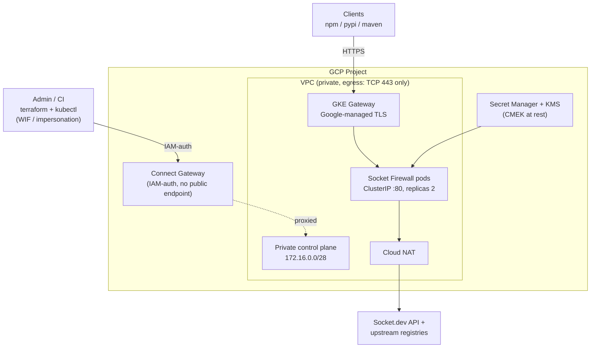
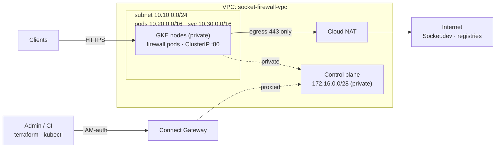
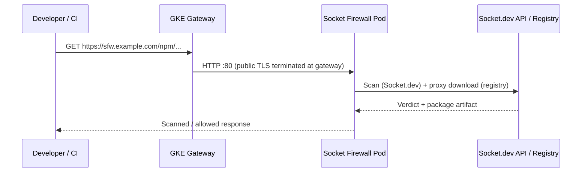

# Security Socket Firewall

Terraform configuration for deploying [Socket Firewall](https://socket.dev) on a hardened private GKE cluster in Google Cloud. The stack provisions networking, IAM, CMEK encryption, secrets, and a Helm release that proxies and scans package traffic to upstream registries (npm, PyPI, Maven).

Infrastructure code lives in [`terraform/`](terraform/).

## Architecture overview

The deployment runs Socket Firewall on a **private GKE cluster** with a **GKE Gateway**, **Google-managed TLS** via Certificate Manager, **Cloud NAT** for outbound traffic, **CMEK encryption**, **Binary Authorization**, **Calico NetworkPolicies**, and **Secret Manager** for the Socket.dev API token.

The control plane has **no public endpoint and no inbound network path** (private endpoint, `172.16.0.0/28`). Terraform and `kubectl` reach it through **fleet Connect Gateway** — the cluster's GKE-managed Connect agent opens an *outbound* channel to Google, and `connectgateway.googleapis.com` proxies IAM-authenticated traffic back down it. This works identically from a local machine and from a **GitHub-hosted CI runner** with no bastion, IAP tunnel, or VPC peering. CI runs via Workload Identity Federation with two service accounts: a read-only **plan** SA (PR) and a write **apply** SA (push to `main`).



Full resource detail (Certificate Manager, SSL policy, NetworkPolicies, node SA, firewall rules, etc.) is described in the [Components](#components), [Security](#security), and [Terraform layout](#terraform-layout) sections below.

## Network topology



Egress from GKE nodes is **deny-by-default** at the VPC firewall layer. Only **TCP 443** is permitted outbound (HTTPS to Socket.dev and upstream registries, and the fleet Connect agent's outbound channel to Google). Port 80 is intentionally blocked.

## Data flow



## Components

| Layer | Resource | Purpose |
|-------|----------|---------|
| **Network** | VPC + subnet + secondary ranges | Isolated network; subnet has VPC flow logs |
| **Egress** | Deny-all + allow TCP 443 + Cloud NAT | Default-deny egress; HTTPS-only outbound via NAT scoped to the subnet |
| **Compute** | Private GKE cluster + node pool | Shielded nodes, deletion protection, Calico NetworkPolicy, Binary Authorization |
| **Encryption** | Cloud KMS key ring (3 keys) | CMEK for etcd secrets, node boot disks, and Secret Manager |
| **Access** | Fleet membership + Connect Gateway | IAM-authenticated proxy to the private control plane; no public endpoint, bastion, or IAP tunnel |
| **App** | Helm `socket-firewall` | Package firewall with path-based routing, HPA, pod anti-affinity, PDB |
| **Exposure** | GKE Gateway (`gke-l7-global-external-managed`) | External HTTPS when `firewall_domain` is set; `LoadBalancer` Service fallback when domain is unset |
| **Secrets** | Secret Manager (CMEK) → K8s secret | `SOCKET_SECURITY_API_TOKEN` for Socket.dev |
| **TLS** | Certificate Manager + GKE Gateway + SSL policy | Google-managed cert; HTTPS terminates at the LB (TLS 1.2 minimum) |
| **Policy** | Kubernetes NetworkPolicies | Default-deny ingress in the firewall namespace (`enable_network_policies = true`) |
| **IAM** | GKE node SA + custom Terraform roles | Least-privilege; separate read-only plan SA and write apply SA, both via WIF |

### Resources managed outside of this repo

| Layer | Note | Source |
|-------|----------|---------|
| **State** | GCS `sac-prod-tf--socket-firewall` | Created by security-as-code |
| **Terraformer** | service account `socket-firewall-tf-plan@sac-prod-sa.iam.gserviceaccount.com` | Created by security-as-code |
| **Terraformer** | service account `socket-firewall-tf-apply@sac-prod-sa.iam.gserviceaccount.com` | Created by security-as-code |
| **Workload Identity Provider** | Used in GitHub Action for GH <> GCP auth | Created by security-as-code |
| **Secret Value** | Secret `socket-firewall-api-token` | Resource created by terraform, value added out-of-band via `gcloud secrets versions add` |
| **DNS mapping** | DNS records for `sfw.security.sentry.io` | Managed in `Team Security` GCP project |

## Security

| Control | Implementation |
|---------|----------------|
| **Encryption at rest** | CMEK for GKE etcd, node disks, and Secret Manager (90-day key rotation) |
| **Encryption in transit** | GCP-managed TLS at the Gateway; SSL policy enforces RESTRICTED cipher suites and TLS 1.2+ |
| **Network egress** | VPC firewall deny-all with explicit TCP 443 allow; Kubernetes egress governed by VPC rules |
| **Network ingress** | Calico NetworkPolicies default-deny ingress in the firewall namespace |
| **Image admission** | Binary Authorization (`PROJECT_SINGLETON_POLICY_ENFORCE`) |
| **Node hardening** | Shielded VMs, dedicated node SA (no `cloud-platform` scope), Workload Identity, legacy metadata endpoints disabled |
| **Control plane** | Private endpoint only — no public API server; reachable solely via Connect Gateway (IAM-authenticated) |
| **Availability** | HPA, pod anti-affinity, PodDisruptionBudget (`minAvailable: 1`), 2-node minimum. **Zonal cluster** (`us-central1-a`) — these protect against single-node loss, not a full-zone outage, and the control plane has no HA SLA |
| **IAM least privilege** | Custom Terraform roles replace `container.admin`/`secretmanager.secretAdmin`/`cloudkms.admin` (no project-wide secret payload access); read-only plan SA distinct from write apply SA; fleet write access is bootstrap-only |
| **Audit** | VPC flow logs and firewall rule logging with full metadata |

## Path routing

When `firewall_domain` is set, the firewall exposes these upstream routes (defaults):

| Path | Upstream | Registry |
|------|----------|----------|
| `/npm` | `registry.npmjs.org` | npm |
| `/pypi` | `pypi.org` | pypi |
| `/maven` | `repo1.maven.org/maven2` | maven |

Health check endpoint: `https://<firewall_domain>/health`

## TLS

When `firewall_domain` is set, Terraform always provisions GCP-managed TLS:

1. A **Certificate Manager DNS authorization** — publish the CNAME from `terraform output tls_dns_authorization_record`
2. A **Google-managed certificate** — becomes `ACTIVE` after DNS validation (typically 15–60 minutes)
3. An **external GKE Gateway** (`gke-l7-global-external-managed`) with a **certificate map** — terminates public HTTPS at the load balancer. When using the certmap annotation the listener has **no `tls` block** (TLS is configured entirely by the annotation; adding a `tls` section is rejected)
4. A **global SSL policy** (`RESTRICTED`, TLS 1.2 minimum) attached via **GCPGatewayPolicy**
5. An **HTTPRoute** — forwards traffic to the firewall pods (backend `port 80`, plain HTTP)
6. A **HealthCheckPolicy** — points the load-balancer health check at `/health`. Without it the LB defaults to probing `/`, which the firewall does not answer with `200`, so every backend is marked unhealthy (`no healthy upstream`)

The Gateway terminates the public, browser-trusted certificate and forwards to the pods over **plain HTTP on port 80** (cluster-internal `ClusterIP`, never externally reachable). The firewall image nevertheless always configures an HTTPS listener (`:8443`) that requires a certificate to load, so the chart's cert-generator init container produces a **self-signed certificate** purely so nginx will boot — it is not on the Gateway's data path.

## Terraform layout

| File | Description |
|------|-------------|
| [`main.tf`](terraform/main.tf) | Providers (google, google-beta, kubernetes, helm, kubectl), GCS backend, Connect Gateway provider configuration |
| [`apis.tf`](terraform/apis.tf) | Required GCP API enablement (incl. `gkehub`, `connectgateway`) |
| [`kms.tf`](terraform/kms.tf) | CMEK key ring and keys for etcd, node disks, and Secret Manager |
| [`network.tf`](terraform/network.tf) | VPC, subnet (flow logs), Cloud NAT, egress firewall rules |
| [`network_policy.tf`](terraform/network_policy.tf) | Kubernetes NetworkPolicies (default-deny ingress) |
| [`gke.tf`](terraform/gke.tf) | Private GKE cluster (CMEK etcd, Calico, Binary Auth, Gateway API) and node pool |
| [`fleet.tf`](terraform/fleet.tf) | Fleet (GKE Hub) membership enabling Connect Gateway access to the private control plane |
| [`iam.tf`](terraform/iam.tf) | GKE node SA, custom least-privilege Terraform roles (apply + plan SA), IAM bindings |
| [`secrets.tf`](terraform/secrets.tf) | CMEK-encrypted Secret Manager secret for the Socket API token |
| [`helm.tf`](terraform/helm.tf) | Namespace, K8s secret, Helm release (incl. pod `securityContext`/`fsGroup` so nginx can read the generated cert key) |
| [`tls.tf`](terraform/tls.tf) | Certificate Manager, SSL policy, GKE Gateway, GCPGatewayPolicy, HTTPRoute, HealthCheckPolicy |
| [`variables.tf`](terraform/variables.tf) | Input variables |
| [`outputs.tf`](terraform/outputs.tf) | Cluster credentials, gateway IP, DNS auth record, health URL |

## Getting started

### Prerequisites

- A GCP project with billing enabled
- Two Terraform service accounts — a write **apply** SA (`terraformer`) and a read-only **plan** SA (`terraformer_plan`) — bootstrapped as described below
  - For sentry internal use, theses are created and managed in [security-as-code](https://github.com/getsentry/security-as-code)
- Workload Identity Federation configured for the GitHub repo (`WIF_PROVIDER`, `WIF_APPLY_SERVICE_ACCOUNT`, `WIF_PLAN_SERVICE_ACCOUNT`)
  - For sentry internal use, theses are created and managed in [security-as-code](https://github.com/getsentry/security-as-code)

No VPC peering, bastion, or IAP tunnel is required. The private control plane is reached over **fleet Connect Gateway**, so `terraform apply` and `kubectl` work from a local machine or a GitHub-hosted runner once the SA is authenticated.

### Bootstrap IAM

The steady-state, least-privilege roles for both service accounts are defined and bound **by Terraform itself** in [`terraform/iam.tf`](terraform/iam.tf) — custom roles replace the broad predefined `container.admin`, `secretmanager.secretAdmin`, and `cloudkms.admin` roles.

Roles Terraform grants to the **apply SA**:

| Role | Purpose |
|------|---------|
| Custom `socketFirewallTfGkeManager` | GKE cluster / node-pool lifecycle (GCP control plane only) |
| `roles/container.developer` | Kubernetes API access for the helm/kubernetes/kubectl providers |
| `roles/compute.networkAdmin` | VPC, subnet, NAT, firewall rules |
| Custom `socketFirewallTfServiceAccountManager` | Manage the GKE node service account |
| Custom `socketFirewallTfSecretManager` | Manage Secret Manager resources (no project-wide payload read) |
| `roles/secretmanager.secretAccessor` | Read the Socket API token (resource-scoped) |
| Custom `socketFirewallTfKmsManager` | CMEK key ring / key management (no key or version destruction) |
| `roles/certificatemanager.editor` | Certificate Manager certs and DNS authorizations |
| `roles/iam.serviceAccountUser` | Attach the node SA to node-pool VMs |
| `roles/gkehub.gatewayEditor` + `roles/gkehub.viewer` | Reach the control plane via Connect Gateway; refresh the fleet membership |

The **plan SA** receives read-only equivalents: custom `socketFirewallTfPlanReader`, `roles/container.viewer`, `roles/certificatemanager.viewer`, and `roles/gkehub.gatewayReader`.

Because Terraform creates these custom roles and bindings on the first apply, the bootstrap identity (a project admin) must first grant the apply SA enough elevated access to perform that initial run, then tighten it:

| Bootstrap grant | Why | After first apply |
|------|-----|-------------------|
| `roles/iam.roleAdmin` | Create the custom roles in `iam.tf` | Keep (roles are re-managed on every apply) |
| `roles/resourcemanager.projectIamAdmin` | Create the project IAM bindings in `iam.tf` | Keep |
| `roles/serviceusage.serviceUsageAdmin` | Enable the required APIs (`apis.tf`) | Keep |
| `roles/gkehub.editor` | Register the fleet membership (`fleet.tf`, `memberships.create`) | **Revoke** — steady-state only refreshes it via `gkehub.viewer` |

### CI/CD

GitHub Actions workflows for infrastructure and version management:

| Workflow | Trigger | Identity | Action |
|----------|---------|----------|--------|
| [`tf-plan.yaml`](.github/workflows/tf-plan.yaml) | Pull request to `main` | Plan SA (read-only, WIF) | `terraform plan`, posts diff as a PR comment |
| [`tf-apply.yaml`](.github/workflows/tf-apply.yaml) | Push to `main` | Apply SA (write, WIF) | `terraform apply -auto-approve` (in the `production` environment) |
| [`check-firewall-versions.yaml`](.github/workflows/check-firewall-versions.yaml) | Weekly (Mon 09:00 UTC) + manual | GitHub App (`getsantry[bot]`) | Check upstream chart/image releases; open a PR if newer versions exist |

Terraform plan/apply runners are GitHub-hosted and reach the private control plane through Connect Gateway — no self-hosted runner inside the VPC is needed.

### Chart and image version updates

The firewall image tag (`firewall_image_tag`) and Helm chart version (`helm_chart_version`) are **pinned in Terraform** — the chart’s default `latest` tag is not used. See [`helm.tf`](terraform/helm.tf).

| Variable | Default (in `variables.tf`) | Upstream source |
|----------|----------------------------|-----------------|
| `helm_chart_version` | `0.2.4` | [socket-firewall Helm index](https://socketdev-demo.github.io/socket-firewall-helm/index.yaml) |
| `firewall_image_tag` | `1.1.159` | [`socketdev/socket-registry-firewall`](https://hub.docker.com/r/socketdev/socket-registry-firewall) on Docker Hub |

#### Automated checks

[`check-firewall-versions.yaml`](.github/workflows/check-firewall-versions.yaml) runs on a schedule and can be triggered manually:

- **Schedule:** Mondays at 09:00 UTC
- **Manual run:** **Actions → Check Firewall Versions → Run workflow**

The workflow fetches the latest Helm chart version and the highest `x.y.z` Docker tag, compares them to the defaults in `terraform/variables.tf`, and opens a PR when either is newer. PRs are created by `getsantry[bot]` using a GitHub App token.

**Repository configuration** (for the version-check workflow):

| Setting | Type | Purpose |
|---------|------|---------|
| `SENTRY_INTERNAL_APP_ID` | Variable | GitHub App ID used to create version-bump PRs |
| `SENTRY_INTERNAL_APP_PRIVATE_KEY` | Secret | GitHub App private key |

The app needs permission to push branches and open pull requests on this repo.

#### Upgrade flow

1. The workflow opens a PR updating `helm_chart_version` and/or `firewall_image_tag` in `terraform/variables.tf`.
2. If you override versions in `terraform.tfvars`, update those values to match before merging — Terraform auto-loads `terraform.tfvars`, so it overrides the `variables.tf` defaults the workflow bumps.
3. Review the `terraform plan` check on the PR — expect a Helm release change and pod rollout.
4. Confirm the new image is allowed by **Binary Authorization** (project singleton policy). If admission blocks the rollout, add the digest to the allow policy before merging.
5. Merge to `main` → `tf-apply` rolls out the new version.

To bump versions by hand (without waiting for the workflow), edit `helm_chart_version` / `firewall_image_tag` in `terraform/variables.tf` (and `terraform.tfvars` if used) and open a PR as usual.

### Deploy

0. Authenticate as the terraformer service account locally, there's 2 recommanded options

   1. Use `sac-terraform-auth`: run `eval "$(sac-terraform-auth socket-firewall-tf-apply@sac-prod-sa.iam.gserviceaccount.com)"` to export gcloud token to your terminal env var
   2. Use [sudo-gcp](https://github.com/getsentry/sudo-gcp): wrap all following command with `sudo-gcp`, e.g. `sudo-gcp terraform init`, `sudo-gcp terraform apply`

1. Initialise Terraform and create the KMS key ring and Secret Manager secret container:

   ```bash
   cd terraform
   terraform init
   terraform apply \
     -target=google_kms_key_ring.main \
     -target=google_kms_crypto_key.secret \
     -target=google_kms_crypto_key_iam_member.secret \
     -target=google_secret_manager_secret.socket_api_token
   ```

2. Load the Socket API token into the secret created in step 1:

   ```bash
   gcloud secrets versions add socket-firewall-api-token --data-file=- <<< "sktsec_..."
   ```

3. Apply the rest of the stack (Connect Gateway handles control-plane access, so this works locally or in CI):

   ```bash
   terraform plan
   terraform apply
   ```

4. If `firewall_domain` is set, configure DNS:

   ```bash
   # Publish the CNAME for certificate validation
   terraform output tls_dns_authorization_record

   # After the certificate is ACTIVE (15–60 min), point the domain at the gateway IP
   terraform output firewall_load_balancer_ip
   ```

   > `firewall_load_balancer_ip` is read from the live Gateway status and may be empty until the GKE Gateway controller assigns the external address (a few minutes after the first apply). If it's blank, re-run after a `terraform refresh`, or read it directly with `kubectl get gateway socket-firewall-gateway -n socket-firewall -o wide`.

5. Configure `kubectl`. The control plane has no public endpoint, so fetch credentials through Connect Gateway rather than the direct endpoint:

   ```bash
   gcloud container fleet memberships get-credentials socket-firewall --project <project_id>
   ```

> **CMEK migration warning:** If an existing Secret Manager secret used auto-replication, switching to CMEK user-managed replication forces secret replacement and deletes existing versions. Re-add the token value after apply.

## Operations & troubleshooting

### Accessing the cluster (`kubectl` / logs)

The control plane has no public endpoint, so always get credentials through Connect Gateway:

```bash
gcloud container fleet memberships get-credentials socket-firewall --project <project_id>
```

Connect Gateway proxies the Kubernetes API, but **streaming** operations (`kubectl logs`, `exec`, `port-forward`, `run -it`) frequently fail with `No agent available`. Plain API reads (`get`, `describe`) work fine. To read container logs, query **Cloud Logging** instead (nodes have `logging.write`, so stdout/stderr is captured regardless):

```bash
gcloud logging read \
  'resource.type="k8s_container"
   resource.labels.cluster_name="socket-firewall"
   resource.labels.namespace_name="socket-firewall"
   resource.labels.container_name="socket-firewall"
   severity>=DEFAULT' \
  --project <project_id> --limit 100 --freshness=2h \
  --format='value(timestamp, severity, textPayload)'
```

### Common issues

| Symptom | Cause | Fix |
|---------|-------|-----|
| `cannot create REST client: no client config` (plan) | `kubernetes_manifest` does a live API call at plan time before the cluster exists | Gateway manifests use `kubectl_manifest` (alekc/kubectl) with `lazy_load = true` instead |
| `invalid configuration: no configuration has been provided` (kubectl provider) | alekc/kubectl ≥ 2.3 validates eagerly when the cluster endpoint is still unknown | `lazy_load = true` (requires provider ≥ 2.4) |
| `dial tcp 172.16.0.x:443: i/o timeout` | Running against the private endpoint directly from outside the VPC | Use Connect Gateway (the configured provider host), not the direct endpoint |
| Certificate stuck `PROVISIONING`, `CNAME_MISMATCH` | The `_acme-challenge.<domain>` validation CNAME isn't published / not propagated | Publish `terraform output tls_dns_authorization_record`; Certificate Manager retries on backoff (often 15–60 min) |
| TLS handshake reset on the hostname | Managed cert not yet `ACTIVE` | Wait for `ACTIVE`, then allow a few minutes for the LB frontend to pick it up |
| `helm` release times out (`context deadline exceeded`) but pods are fine | `wait = true` timeout too short during a slow first rollout | Increase `timeout`; a *failed* release gets tainted and reinstalled each apply, so reconcile it (`helm uninstall` / `helm rollback`) before retrying |
| Pods `CrashLoopBackOff`, logs show `cannot load certificate key ... Permission denied` | Cert-generator init runs as UID 1000 but the image runs as UID 1001, so nginx can't read the `0600` key | `podSecurityContext.fsGroup` + cert-generator `runAsUser` aligned to the image UID (set in `helm.tf`) |
| `503 no healthy upstream` while pods are `Ready` | LB health check probes `/` (its default), which the firewall doesn't answer `200` | `HealthCheckPolicy` pointing the LB health check at `/health` (in `tls.tf`) |
| Gateway "load balancer" not visible | The data-plane LB is a Gateway-managed **global external ALB** (`gkegw1-…`), not a `LoadBalancer` Service | `kubectl get gateway -A` for the address; `gcloud compute forwarding-rules list --global` |

### Verifying the data plane

```bash
kubectl get gateway socket-firewall-gateway -n socket-firewall -o wide        # ADDRESS = LB IP
gcloud compute backend-services get-health <gkegw1-…-socket-firewall-80-…> \
  --global --project <project_id>                                             # expect HEALTHY
curl -sv https://<firewall_domain>/health                                     # expect 200
```
